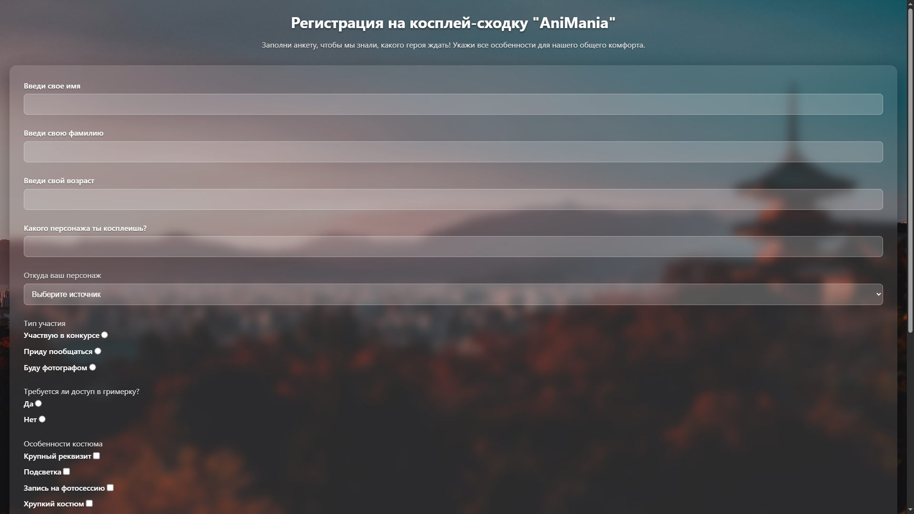
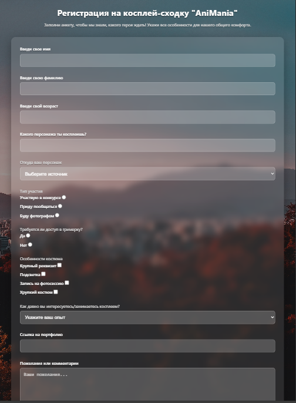
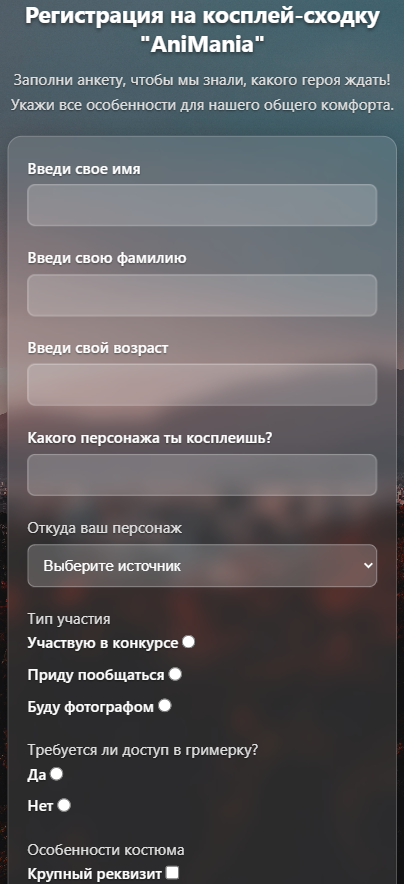

# 🎭 Косплей-форма регистрации

Адаптивная форма регистрации для косплей-мероприятия с современным дизайном и стеклянным эффектом.

## 📸 Скриншоты

| Десктоп                                    | Планшет                                  | Мобильный                                |
| ------------------------------------------ | ---------------------------------------- | ---------------------------------------- |
|  |  |  |

## ✨ Особенности

- **Современный дизайн** - Glass morphism эффект
- **Полная адаптивность** - Оптимально на всех устройствах
- **Интерактивность** - Плавные анимации и hover-эффекты
- **Доступность** - Семантическая верстка и правильные label
- **UX-ориентированность** - Интуитивная структура полей

## 🛠 Технологии

- **HTML5** - Семантическая разметка
- **CSS3** - Flexbox, Grid, анимации, медиа-запросы
- **Glass Morphism** - Современный визуальный стиль
- **Mobile First** - Подход к разработке

## 📋 Функциональность

- Валидация полей ввода
- Адаптивный дизайн (мобильные, планшеты, десктоп)
- Интерактивные элементы формы
- Оптимизированная пользовательская форма

## 🚀 Установка и запуск

1. Клонируйте репозиторий:

```bash
git clone https://github.com/your-username/cosplay-registration-form.git
```
